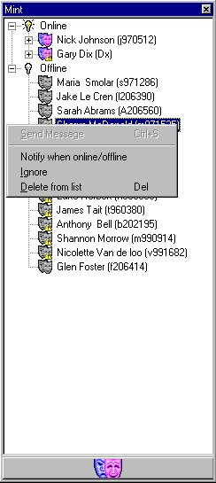



## Mint \- Serverless NT instant messenger

### Description

Mint is an instant messenger for Windows NT. IT uses the NetSendMessage API and many others to display a constantly-updated list of users you have chosen to monitor, and allows you to send messages to them, ignore them, and be notified when they go online/offline! Mint does all this without requiring the other person to be running Mint themselves. (although Mint is required if they wish to reply). The interface is similar to that used by ICQ, and provides many similar features, but without requiring a central server, or other clients
 
### More Info
 

             |
---                |---
**Submitted On**   |2000-07-27 10:31:02
**By**             |[Nick Johnson](https://github.com/Planet-Source-Code/PSCIndex/blob/master/ByAuthor/nick-johnson.md)
**Level**          |Advanced
**User Rating**    |5.0 (30 globes from 6 users)
**Compatibility**  |VB 5\.0, VB 6\.0
**Category**       |[Complete Applications](https://github.com/Planet-Source-Code/PSCIndex/blob/master/ByCategory/complete-applications__1-27.md)
**World**          |[Visual Basic](https://github.com/Planet-Source-Code/PSCIndex/blob/master/ByWorld/visual-basic.md)
**Archive File**   |[CODE\_UPLOAD82197262000\.zip](https://github.com/Planet-Source-Code/nick-johnson-mint-serverless-nt-instant-messenger__1-10109/archive/master.zip)

